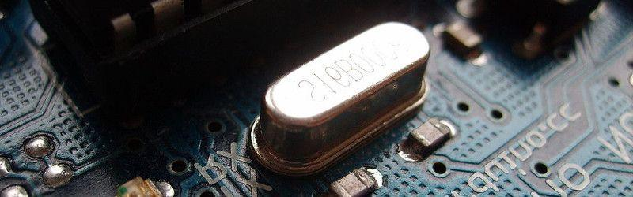
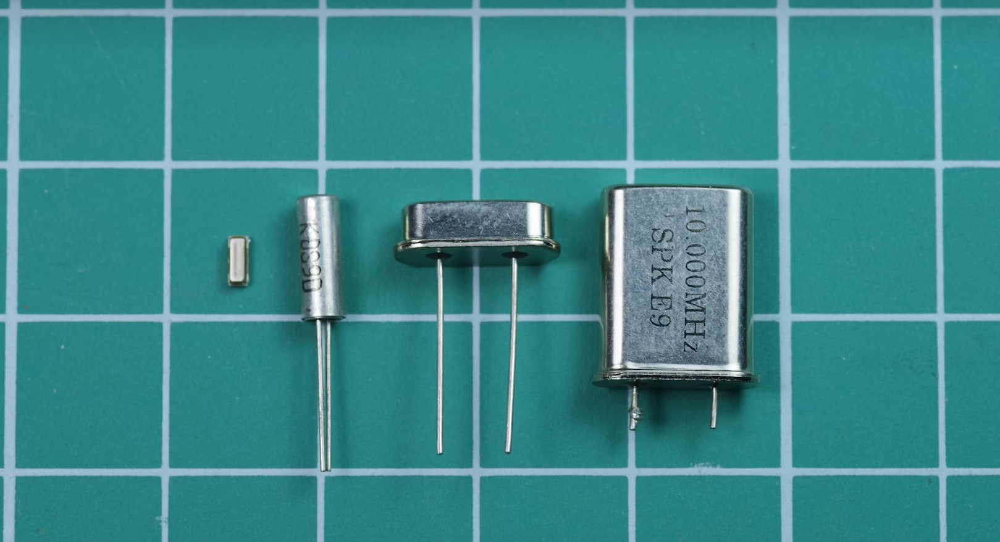
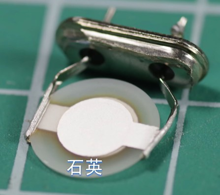
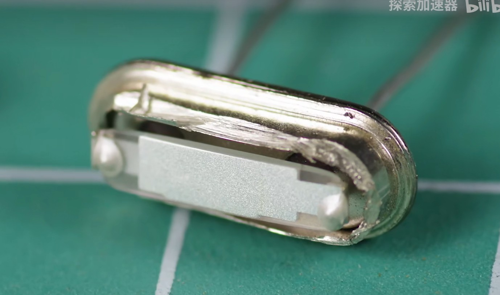
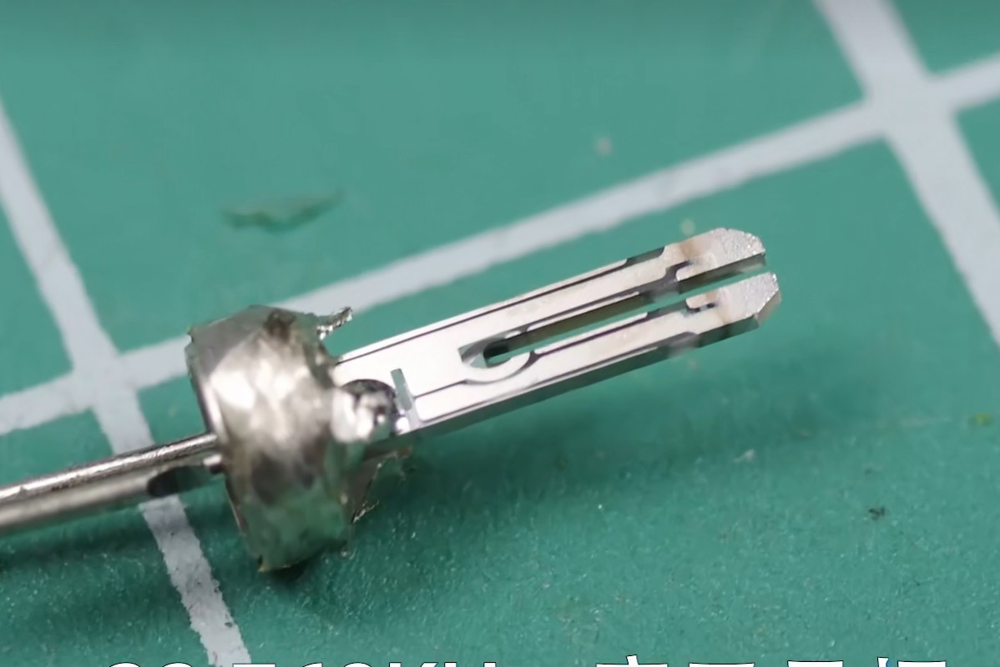

# Sketch — Crystal Oscillator

## Assignment's description
Explain the structure, principles, manufacturing process, and functions of electronic components (crystal oscillators) through hand-sketching, referencing the style of naturalistic illustrations.

## Documentation

### **Some Explanation**
First, we need to understand what is the crystal oscillators.

The main function of a crystal oscillator is to provide time reference to microcontrollers. On our own Arduino board, the crystal oscillator vibrates at 16,000 times per second to indicate the working frequency of the ATmega. It acts like a ruler, because an unstable working frequency can cause issues with related devices and the chip itself.

Next, I will give a general explanation of crystal oscillators, including their principles, structure, and manufacturing process.

The first question is, how is time generated and recorded?
We can divide a day into twenty-four parts, each part representing one hour, and each hour consisting of sixty minutes, with each minute having sixty seconds. This way, we divide time into 86,400 parts. If we can find something that jumps an average of 86,400 times per day, then each jump represents one second, and we can use this object's jumps to record time.

So, the second question is, what can keep jumping or beating averagely? The answer is a crystal. In physics, there is a phenomenon called piezoelectric effect（压电效应）. When pressure is applied to a crystal, it generates voltage. Conversely, if we apply an electric current to a crystal, it‘s shape will change. When we connect an alternating current through a crystal, it produces regular mechanical vibrations, which in turn generate corresponding vibration voltages with specific frequencies. This stable wave can serve as a signal for the ship, like Atmega.

Next, we connect the crystal oscillator to a circuit. The circuit contains various noise Wave. By amplifying the signal that passes through the crystal oscillator, only the Wave close to the frequency of the crystal oscillator can pass through and be continuously amplified. After a few cycles, the circuit can output a stable signal, which is called resonance（谐振）.

The oscillation frequency of the crystal oscillator depends on the shape, material, cutting direction, and other factors of the sliced crystal.

Now, think about that we want to use the crystal oscillator to make a watch. We need a frequency divider system, which continuously divides the frequency by two until it reaches 1 Hz, so that the second hand（秒针） moves once per second.

One thing to note is that passive crystal oscillators must be grounded with two capacitors; otherwise, they may not start oscillating. 
The specific calculation method for the capacitor is very complex and you can learn it by interested.

Next, let's talk about the internal structure of the crystal oscillator. If we cut open the casing, we will see a structure like this. 
A piece of crystal is cut into a wafer shape, electrodes (two pieces of metal)  are attached to both sides, and the mentle sheets are connected to the crystal base through wires and pins. When we apply power, the current can act on the crystal.

After packaging the crystal oscillator in a casing, it can be used on a circuit board.

Crystal oscillators have various different forms, such as this four types shown here, which essentially apply current to the cut crystals in different ways.

