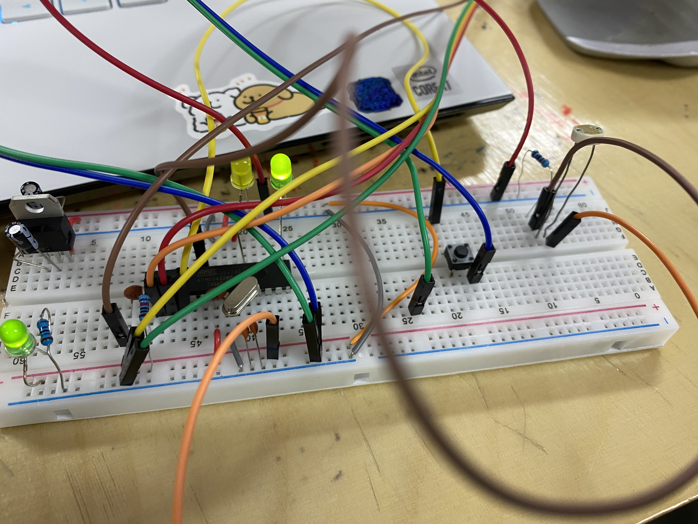
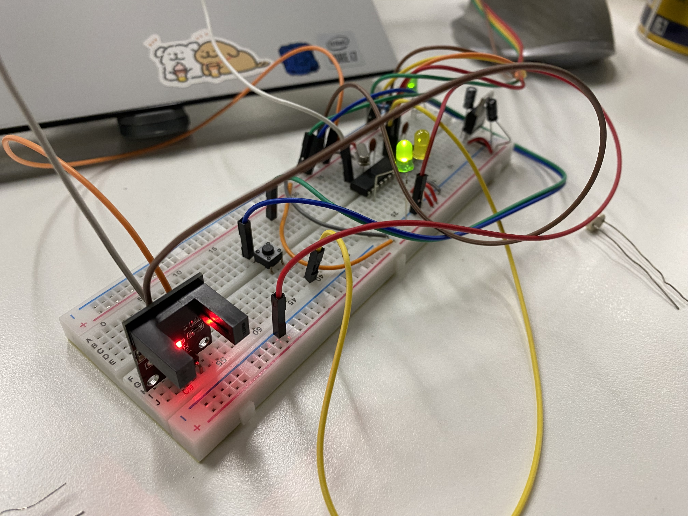

# Sensors

## Assignment's description


## Classroom Experiment
The main content of this lesson is the study and practice of analog signals and digital signals.


1. First, we tested the basic digital signal using a switch. When the switch is closed, Pin 2 receives a 5V signal. When the switch is open, it receives a GND (0V) signal. The purpose of connecting the resistor is to prevent a short circuit.


When the switch is pressed, the light will turn on.

2. Performed a simple practice on analog signals and adjusted using a potentiometer.


## Pressure Sensor
Pressure sensor, essentially is a force-sensitive resistor or force sensor, commonly known as FSR. It is low cost, easy to use, and specifically designed for detecting physical pressure, squeezing, and weight.


Commonly used in electronic drums, mobile phones, handheld gaming devices, and many other portable electronic products.

Although these sensors are great for measuring pressure, they are not good at determining the exact amount of weight they are bearing.

However, if you just want to find out "whether the sensor is being squeezed or pressed" and how much, they are a good choice.


* Wiring method:


From the front view, the left pin is connected to the A0 port, while also connected to the negative terminal through a 10kohm resistor; the right pin is connected to the positive level.

```ruby
int FSR_Pin= A0; // Connect to A0
int FSR_Reading; 

void setup() {
   Serial.begin(9600);
 }

void loop() {
   FSR_Reading= analogRead(FSR_Pin);
   Serial.println("Analog Reading = ");
   Serial.println(FSR_Reading);
   delay(1000);
 }
```


## Light Resistor
For a two-pin resistor, the data transmission pin must be connected to GND through a resistor.


Pin 1 is connected to A0 while being grounded through a resistor; Pin 2 is connected to the positive terminal.




The signal output from the photoresistor can be used to determine the intensity of ambient light, allowing for the control of LED light brightness.

```ruby
int Light_Sensor = A0; // Connect to A0
int LED_Pin = 9;

int Val_Min = 300; // set the min value of the environment light
int Val_Max = 1024; //set the max ^

int Sensor_Value;
int LED_Value;

void setup() {
   pinMode(Light_Sensor, INPUT);
   pinMode(LED_Pin, OUTPUT);
   Serial.begin(9600);
 }

void loop() {
   Sensor_Value = analogRead(Light_Sensor);
   Serial.println("Analog reading = ");
   Serial.println(Sensor_Value); // Print in the monitor
   
   Sensor_Value = constrain(Sensor_Value, Val_Min, Val_Max);
   LED_Value = map(Sensor_Value, Val_Min, Val_Max, 0, 255);

   Serial.println("Sensor Value = ");
   Serial.println(Sensor_Value);
   Serial.println("LED Value = ");
   Serial.println(LED_Value);

   delay(500);

   analogWrite(LED_Pin, LED_Value);
 }
```


## U-shaped Photoelectric Sensor


```ruby
int Value;
int Sensor_Pin = 7;
int LED_Pin = 9;

void setup() {
   Serial.begin(9600);
   pinMode(Sensor_Pin, INPUT);
   pinMode(LED_Pin, OUTPUT);
 }

void loop() {
   Value = digitalRead(Sensor_Pin);
   if(Value == HIGH)
   {
	   digitalWrite(LED_Pin, LOW);
     Serial.println("Digital Read = ");
     Serial.println(Value);
     delay(300);
   }
   else 
   {
	   digitalWrite(LED_Pin, HIGH);
     Serial.println("Digital Read = ");
     Serial.println(Value);
     delay(300);
   }
}
```





