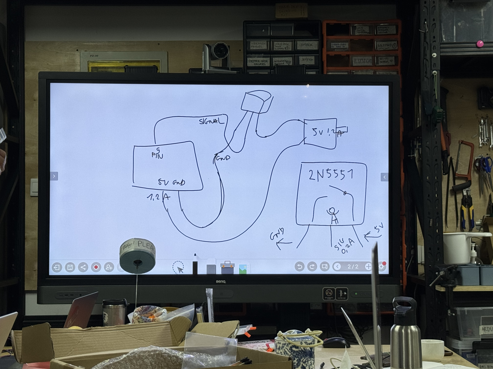

# Actuator

## Assignment's description
In this section, we will use our own development board to learn about actuators. We will explore three different control methods for actuators through the experimentation with three actuators.

## Documentation

### Actuator 1: Servo Motor - Direct control through analog input, PWM digital output

Effect: Control motor angle by rotating potentiometer

Connect the potentiometer to A0 and the motor to PIN9. Upload the code and the motor will rotate corresponding to the rotation of the potentiometer.

### LCD Electronic Screen - Simplifying Wiring and Programming by Communicating Between Control Boards Using SLA and SDA

I2C and TX RX communication differences

TX is like making a landline telephone call.

Connection method: Connect A5 and A4, where A5 is SCL and A4 is SDA. Connect SCL to SCL and SDA to SDA. Then, connect GND and VCC.

In this case, you need to use libraries that are not pre-installed in the Arduino IDE. You need to download them first. After downloading, locate the example files.

In this example file:

LiquidCrystal_I2C lcd(0x20,16,2);

The "0x20" in this line of code represents the address of this LCD module. To read the device address, you need to use a sample code after connecting the LCD. The following two numbers, 16 and 2, respectively represent the number of columns and rows that this screen can display.

Partial code explanation:

The meaning of `lcd.setCursor(3,0)` is to start displaying from the fourth row, first column.

lcd.setCursor(3,0);

lcd.print("Hello, world!");

Use the code in this example file to read the address of the LCD and modify the above code.

To view the displayed content, simply upload the file.

### Actuator 3: DC Motor

In the signal interface of Arduino, the voltage level is used to control the actuator. However, the current is very small. When controlling output devices like DC motors that have only two pins and require a larger current, a Transistor is needed to add an extra signal pin. This allows the power circuit of the DC motor to be directly connected to 5V and GND.

Above, with these three methods, you can basically control all output devices.

